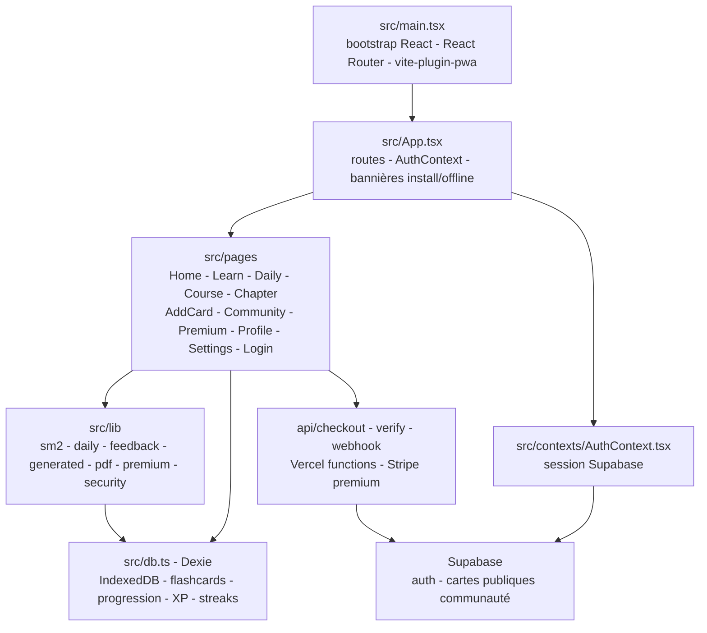

# Genius - Culture Generale

[](https://github.com/Adam-Blf/genius/releases)

<!-- adam-badges:start -->
[](https://github.com/Adam-Blf/genius/commits) [](https://hits.sh/github.com/Adam-Blf/genius/) [](https://github.com/Adam-Blf/genius/commits) [](https://github.com/Adam-Blf/genius) [](LICENSE)
<!-- adam-badges:end -->


PWA Duolingo-like pour apprendre la culture generale en swipant, avec **flashcards generiques** pre-chargees et **ajout de cartes perso** stockees localement.

## Architecture



## Features

- 60+ questions pre-chargees (6 categories - Histoire, Sciences, Geo, Arts, Sports, Divers)
- Ajout de ses propres flashcards (question + bonne reponse + distracteurs optionnels)
- Sessions de 10 cartes tirees aleatoirement, par categorie ou melange
- Systeme XP, series (streaks), vies (regen 1/30min)
- Badges de progression
- Stockage local IndexedDB - aucune donnee ne quitte l'appareil
- PWA installable, offline-first

## Stack

Vite + React 18 + TypeScript + Tailwind 3 + Framer Motion + Dexie + React Router + vite-plugin-pwa

## Dev

```bash
npm install
npm run dev      # http://localhost:5173
npm run build    # dist/
npm run preview
```

## Deploy

Deploy auto via Vercel sur push `main`.

---

<p align="center">
  <sub>Par <a href="https://adam.beloucif.com">Adam Beloucif</a> - Data Engineer & Fullstack Developer - <a href="https://github.com/Adam-Blf">GitHub</a> - <a href="https://www.linkedin.com/in/adambeloucif/">LinkedIn</a></sub>
</p>


## Star History

<a href="https://www.star-history.com/?repos=Adam-Blf%2Fgenius&type=date&legend=top-left">
 <picture>
   <source media="(prefers-color-scheme: dark)" srcset="https://api.star-history.com/chart?repos=Adam-Blf/genius&type=date&theme=dark&legend=top-left" />
   <source media="(prefers-color-scheme: light)" srcset="https://api.star-history.com/chart?repos=Adam-Blf/genius&type=date&legend=top-left" />
   
 </picture>
</a>
